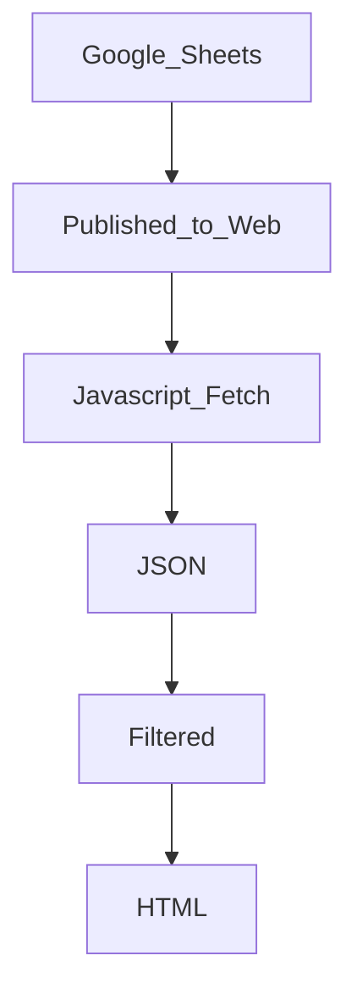

# STEM_Tutor_Pay
### This Project was created to support STEM Tutoring Center
- A simple Javascript application to display wages for STEM tutor based on qualifications of certification, years of experience and degree. 
> The stakeholder and point of contact for the application Jose Crespo
---
- The source data for this application is hosted in [google sheets here](https://docs.google.com/spreadsheets/d/1CyKmLCEJs2mGhd8ZYxi-MT1vyfx-EngK7AwlUdh5H4I/edit?ts=5d9b6ced#gid=91226759)

